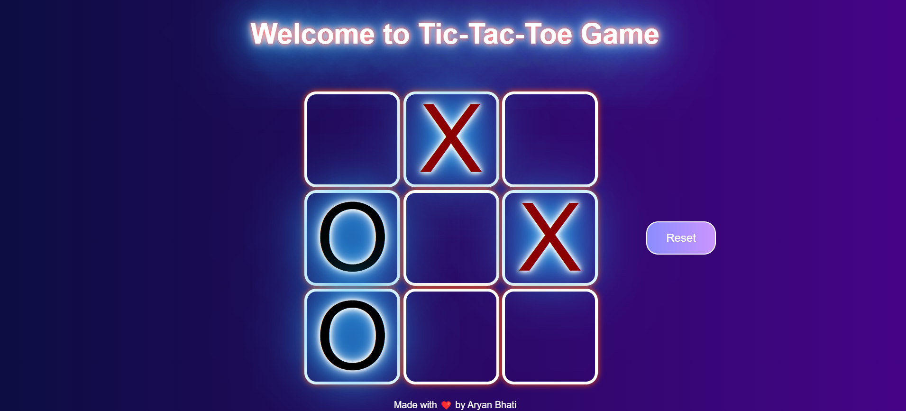

# Tic-Tac-Toe Game🔐

This project consists of the famous Tic-Tac-Toe. I made this project to brush up my JavaScript Skills. 💻

## Screenshot 📸



## Deployed Link 🌐

The website is hosted at: 👉 [Tic-Tac-Toe Game](https://tic-tac-toe-byaryan.vercel.app/)

## Table of Contents

- [Project Structure](#project-structure)
- [Technologies Used](#technologies-used-)
- [Deployed Link](#deployed-link-)
- [Description](#description-)
- [Features](#features-)
- [Screenshot](#screenshot-)
- [Getting Started](#getting-started-)
- [Usage](#usage-)
- [Contributing](#contributing-)
- [Acknowledgments](#acknowledgments-)

## Project Structure

- **index.html**: The main HTML file.
- **style.css**: The CSS file containing the styles for the page.
- **app.js**: The JS file containing the main logic behind the game.

## Technologies Used 🛠️

- HTML
- CSS
- JS

## Description 📝

This project showcases a classic game of Tic-Tac-Toe, providing a hands-on opportunity to reinforce JavaScript proficiency while implementing essential web development concepts. It offers both single and multiplayer modes, engaging users in an interactive gaming experience. It also have a responsive layout 📱💻

## Features 💫

- Amazing UI and UX experience
- Responsive design for different screen sizes
- Enganging attributes to get users engaged

## Getting Started 🚀

To run the project locally, follow these steps:

1. Clone the repository:

```
git clone https://github.com/AryanBhati7/Tic-Tac-Toe
```

2. Navigate to the project directory:

```
cd Tic-Tac-Toe
```

3. Open the `index.html` file in your preferred web browser.

## Usage 🔍

Upon opening the webpage, engage with the Tic-Tac-Toe game by clicking on the grid to make your moves. Enjoy the classic gameplay with friends or challenge the computer in single-player mode.

## Contributing 🤝

As this project was developed for learning purposes, contributions are not accepted currently. However, you're welcome to fork the repository for personal experimentation or learning endeavors.

## Acknowledgments 🙏

- The game's layout and design draw inspiration from traditional Tic-Tac-Toe interfaces, creating a familiar and intuitive user experience. 🎮
- Special thanks to resources like MDN Web Docs and Stack Overflow for invaluable assistance during the development process. 💻
- Gratitude to the vibrant online developer community for continuous support and sharing knowledge. 🌟
